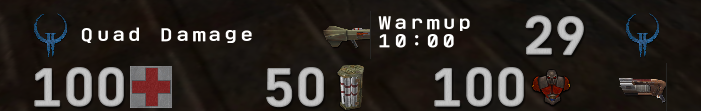
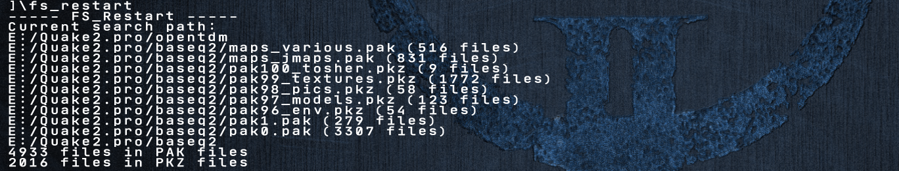

## Summary
* Quake2 32bit textures paks
* Md3 items models (optional)
* Hi-res icons & font (optional)
* Skies (optional)

Based on collection of paks with various high quality 32bit textures paks from various authors and me too.

### Textures v2
Pak file: `pak99_textures.pak`

* [Screenshots](https://github.com/tosher/q2textures/tree/master/screens)

Pack includes all needed textures for maps:
q2dm1, q2dm2, q2dm3, q2dm4, q2dm5, q2dm6, q2dm7, q2dm8, match1, ztn2dm1, ztn2dm2, ztn2dm3, ztn2dm4, ztn2dm5, fury, ptrip, q2next1, q2duel1, q2duel5, q2rdm2, q2rdm7, q2rdm11

> Many textures were updated/fixed/added (22.09.2020).

### MD3 models
Pak file: `pak97_models.pak`

### Icons, font & console/ui background image
Pak file: `pak98_pics.pak`

<p></p>

<p></p>

```
set con_font "prochars"
set scr_font "prochars"
```

### Skies
Pak file: `pak96_env.pak`

* [Blue](https://github.com/tosher/q2textures/tree/master/screens/env-01.png)
* [Red](https://github.com/tosher/q2textures/tree/master/screens/env-02.png)
* [Night (q2rdm11)](https://github.com/tosher/q2textures/tree/master/screens/env-q2rdm11-03.png)

## Qpakman
[Qpakman](https://github.com/bunder/qpakman) - is a command-line tool for managing PAK and WAD files from QuakeI/II & Hexen II.

## Make paks

### Without git
* Download repository as [zip file](https://github.com/tosher/q2textures/archive/master.zip).
* Extract data from zip into some folder
* From extracted directory `q2textures-master`, run `make_paks.bat` (or `make_pkz.bat` for `pkz` paks)
* All paks will be in folder with zip archive.

> You can just extract two files from archive: `make_paks.bat`, `pakman-062b.zip` and run `make_paks.bat`.

### With git
* Clone repo into some folder
* Run `make_paks.bat`

**Quake2** is great!